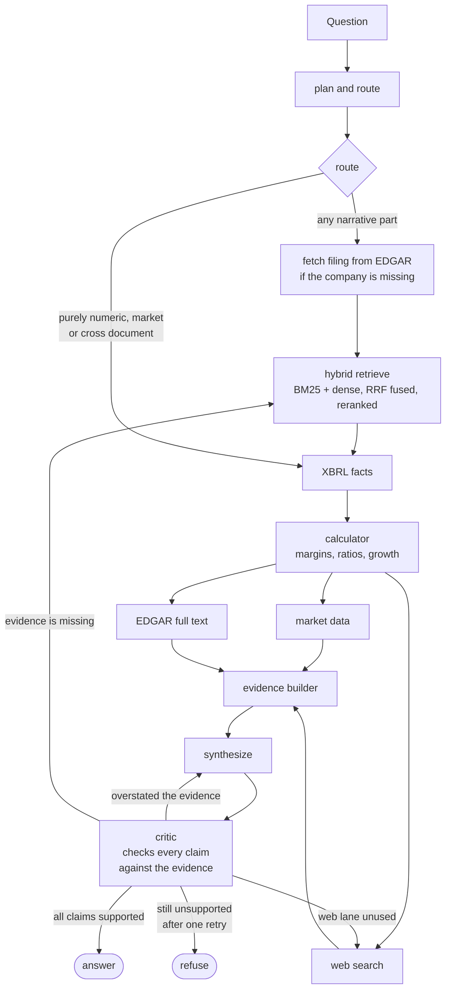

# FinAgent

FinAgent answers questions about SEC filings and listed companies. A LangGraph agent
plans the question, routes each part of it to whichever source can actually answer it,
and writes a cited answer that a fact checking critic then reviews before you see it.

The point of the design is that a language model should not be asked to recall a
number. Figures come from SEC XBRL as filed, ratios are computed in Python from those
figures, prices come from Yahoo Finance, and prose comes from the filings themselves.
The model decides what to look up and how to explain it.

## What it does

* **Grounded answers over filings.** Hybrid retrieval, meaning BM25 and dense vectors
  fused server side by Qdrant, then reranked. Every claim carries a `[N]` citation
  that points at the passage it came from.
* **Exact numbers.** Numeric questions go to SEC XBRL company facts first, so the
  answer quotes the figure as filed rather than a paraphrase of it. Derived metrics
  such as margins, ratios, growth, CAGR and working capital days are computed
  deterministically from those same figures.
* **A corpus that grows itself.** Ask about a company that is not indexed and the
  agent fetches its 10-K from EDGAR, walking back far enough to cover the fiscal year
  you asked about, then keeps it.
* **Live market data.** Price, return and market cap questions hit Yahoo Finance, and
  history requests render an inline candlestick chart.
* **Cross document search.** Questions of the form "which companies disclosed X" run
  EDGAR full text search across all filers.
* **Web search.** Tavily covers events after the filings, and escalates automatically
  when the draft admits the gathered evidence cannot answer.
* **Your own documents.** Attach a PDF or DOCX in the chat. It is parsed with Docling,
  ranked against your question alongside the corpus, and held in memory for about an
  hour. It is never written to the shared index.
* **Deep Research mode.** A second execution path that produces a full cited report by
  running specialist tasks through the same agent and merging them. See
  [`docs/deep-research.md`](docs/deep-research.md).

## Architecture



One planning call does the work of two. It splits the question into sub-questions and
tags each one as narrative, numeric, market, external or cross document in a single
structured call, so every lane downstream selects itself. A purely numeric question
never touches retrieval.

The critic is the only thing that can suppress an answer. It extracts each factual
claim from the draft, checks it against the evidence, and when something does not hold
up it also says which fix would work. If the evidence is there and the draft overstated
it, the answer is rewritten against the same evidence. If the evidence is genuinely
missing, the agent retrieves again using the failed claims as the new queries. There is
exactly one retry. A draft that is still mostly unsupported after it is refused rather
than shipped.

### Models

Each role runs the cheapest model that holds its quality bar, and the roles sit on
different providers so one rate limit does not stop everything.

| Role | Model | Why |
|---|---|---|
| Planner, retrieval query writer | `gemini-3.6-flash` | Decides what retrieval searches for, which is the highest leverage call in the pipeline. |
| Synthesizer | `gemini-3.6-flash` | Long form writing over the assembled evidence. |
| Critic | `gemini-3.5-flash` | Claim checking, on a separate quota bucket from the synthesizer. |
| Tool extraction (XBRL, calculator, formula planner, EDGAR, corpus gate) | `qwen/qwen3.6-27b` on Groq | One shot structured output. Good enough here, free, and it keeps the small Gemini daily budget for the roles that need it. |
| Embeddings | `gemini-embedding-2` at 1536 dims | Matryoshka truncated from 3072 to halve storage. Its 7000 character window keeps whole tables intact, which the previous 512 token encoder could not. |
| Reranker | `cohere:rerank-v4.0-pro` | Falls back to a local `bge-reranker-v2-m3` when the Cohere quota is spent, so an exhausted key pool costs ranking quality rather than the request. |

Bring your own key from the model picker to switch providers per request. Keys stay in
your browser and are sent per request, never stored server side.

### Layout

```
finagent/
  graph/         the LangGraph agent (base -> corrective -> full -> agent)
  tools/         XBRL, calculator, SEC fetch, EDGAR search, market data, web search
  retrieval/     hybrid retriever, filters, reranker
  api/           FastAPI, SSE streaming, agent service
  ingestion/     corpus builders (parse, chunk, embed)
  evaluation/    FinanceBench and RAGAS harnesses
  vectorstore.py  runtime.py  llm.py  device.py
frontend/        React, TypeScript, Vite, Tailwind
```

The pipeline is built as an inheritance ladder, each layer adding one capability:
`AgenticRAG` does plan, retrieve, synthesize and critique; `AgenticRAGv2` adds hybrid
retrieval and the critic retry loop; `AgenticRAGv3` adds the fused plan and route call;
`AgenticRAGv4` adds XBRL, the calculator, dynamic SEC fetch, EDGAR search, market data
and web search. `AgenticRAGv4` is what the API serves.

## Status of the served index

The corpus is being rebuilt on the new embedder. Gemini's free tier meters embedded
chunks rather than requests, at roughly 1000 per key per day, so a full corpus is a
multi day build. The served collection currently holds a seed filing plus whatever
dynamic EDGAR fetch has added since. Questions answered from XBRL, the calculator,
market data, EDGAR search and the web are unaffected, since none of them touch the
vector index.

## Evaluation

The agent is measured on FinanceBench, 150 open source questions over US filings.
Retrieval is scored separately from answers, because they fail for different reasons
and fixing one does not fix the other.

```bash
# answer the question set across the key pool (resumable)
python -m finagent.evaluation.financebench.parallel --workers 3 \
    --output results/financebench_full_outputs.json

# score those answers and write the metrics report
python -m finagent.evaluation.financebench.parallel --score \
    --output results/financebench_full_outputs.json

# retrieval only, one arm
python -m finagent.evaluation.evaluate_retrieval --stage one \
    --parent 2500 --child 600 --mode served
```

Answers are scored with RAGAS on faithfulness, groundedness, answer relevancy, context
precision, context recall and answer correctness. Only the last of those compares the
answer to the gold answer, which matters because every other metric can score a
confidently wrong answer perfectly as long as it is faithful to the chunk it came from.

Retrieval is scored on hit@k and MRR against evidence coverage. The current baseline is
79 of 99 answerable questions at hit@8. `results/RETRIEVAL_EXPERIMENTS.md` records every
change that was tried, including the ones that lost, which is most of them. Two results
worth knowing: giving each chunk a context header of company, year, form and section
took hit@8 from 40 to 57, and rewriting the question into the filing's own vocabulary
before searching took it from 75 to 79.

The eval reads a dedicated collection rather than the served one, so it measures
retrieval instead of whatever EDGAR happened to have that day.

## Run it locally

You need Python 3.11 or newer, Node 20 or newer, and a Qdrant cluster. A Gemini key is
required, and Groq and Cohere keys are recommended.

```bash
git clone https://github.com/<your-user>/FinAgent.git
cd FinAgent

python -m venv .venv && source .venv/bin/activate
pip install -e ".[dev]"

cp .env.example .env        # fill in the keys

uvicorn finagent.api.main:app --reload --port 8000
cd frontend && npm install && npm run dev
```

Open http://localhost:5173 and ask something.

To seed a collection with one filing:

```bash
pip install -e ".[ingest]"
python -m finagent.ingestion.fetchPDFs
python scripts/seed_collection.py --ticker AAPL
```

Ingestion is idempotent. Point ids are derived from the filing, the position and the
content, so re-running overwrites instead of duplicating, and a local sqlite cache of
embeddings means a re-run costs no API quota.

Run the tests with `pytest`.

## Configuration

| Variable | Purpose |
|---|---|
| `GEMINI_API_KEYS` | Planner, synthesizer, critic and embeddings. Several keys separated by commas, rotated on rate limit. |
| `GROQ_API_KEYS` | Tool extraction. Same consolidated format. |
| `COHERE_API_KEYS` | Reranking. Falls back to the local cross encoder when spent. |
| `QDRANT_URL`, `QDRANT_API_KEY` | The cluster holding the corpus. Required. |
| `TAVILY_API_KEY` | Web search. Optional but recommended. |
| `US_COLLECTION` | Which collection to serve. |
| `EMBEDDING_MODEL` | Defaults to `gemini-embedding-2`. Must match how the collection was built. |
| `RERANKER_MODEL` | Defaults to `cohere:rerank-v4.0-pro`. |
| `PERSIST_DYNAMIC_FETCH` | When true, a fetched filing is written into the shared index. |
| `LANGFUSE_PUBLIC_KEY`, `LANGFUSE_SECRET_KEY`, `LANGFUSE_BASE_URL` | Tracing. Optional. |

The consolidated `*_API_KEYS` form exists so a whole key pool costs one Secret Manager
version instead of one per key. The numbered form, `GEMINI_API_KEY1` through
`GEMINI_API_KEY32`, works too and is easier locally.

## Deployment

Pushing to `main` runs the workflow in `.github/workflows/deploy.yml`. The backend
builds into a single Cloud Run image that serves both the API and the SPA and scales to
zero. The corpus lives in Qdrant rather than the image. The frontend deploys to Firebase
Hosting. Authentication to GCP is keyless through Workload Identity Federation, so there
is no service account JSON anywhere in the repo.

Free tier limits shape a lot of this. Embedding quota is metered per chunk per day,
Cohere rerank is metered per month, and the chat models are metered per minute and per
day. Each of those has a fallback rather than an error path: embeddings degrade to
answering from the tool lanes, reranking degrades to the local cross encoder, and chat
rate limits surface as a message telling you when the limit resets and offering the
model picker so you can supply your own key.

## Observability

With `LANGFUSE_*` set, every query produces one trace with a span per graph node, each
LLM call with its prompt, completion and token usage, and the retrieval inputs and
outputs. Chat threads map to Langfuse sessions so follow up turns group together.
Traces are flushed before the response returns, which matters because Cloud Run
throttles CPU after a response and would otherwise drop them. Without the keys, tracing
is a no-op.

Every answer also carries its own metrics regardless of tracing: token totals per model,
per node latencies, tool lane health, and the audit trail of which sources backed which
claim.
