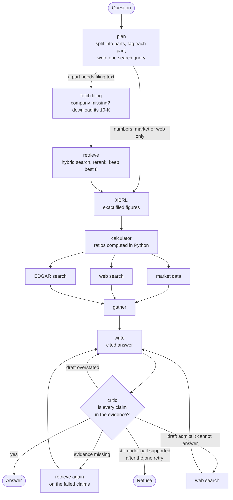
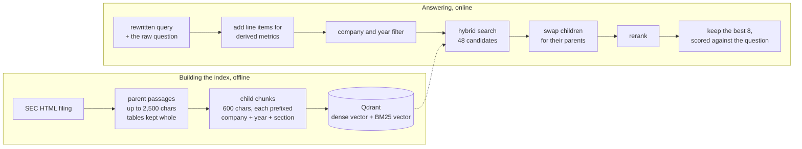

# FinAgent

FinAgent answers questions about US public companies. It splits a question into
parts, sends each part to the source that can actually answer it, writes a cited
answer, and has a second model fact-check every claim before you see it.

The idea behind the design: a language model should not be asked to remember a
number. Figures come from the SEC's structured data, ratios are computed in
Python, prices come from Yahoo Finance, and explanations come from the filings.
The models decide what to look up and how to explain it.

## What it can do

| Capability | Source |
|---|---|
| Answers grounded in filing text, with `[N]` citations | 10-K filings in Qdrant, hybrid search + rerank |
| Exact reported figures | SEC XBRL company-facts API |
| Margins, ratios, growth, CAGR, working-capital days | A Python calculator over the XBRL figures |
| Companies that are not indexed yet | Their 10-K is fetched from EDGAR and indexed on the spot |
| Price, volume, charts | Yahoo Finance |
| "Which companies disclosed X?" | EDGAR full-text search |
| News and events after the latest filing | Tavily web search |

## How a question is answered


```mermaid
flowchart TD
    Q([Question]) --> P[plan<br/>split into parts, tag each part,<br/>write one search query]
    P -->|a part needs filing text| F[fetch filing<br/>company missing? download its 10-K]
    F --> R[retrieve<br/>hybrid search, rerank, keep best 8]
    P -->|numbers, market or web only| X
    R --> X[XBRL<br/>exact filed figures]
    X --> C[calculator<br/>ratios computed in Python]
    C --> M[market data]
    C --> W[web search]
    C --> E[EDGAR search]
    M --> G[gather]
    W --> G
    E --> G
    G --> S[write<br/>cited answer]
    S --> K{critic<br/>is every claim<br/>in the evidence?}
    K -->|yes| A([Answer])
    K -->|draft overstated| S
    K -->|evidence missing| R2[retrieve again<br/>on the failed claims] --> S
    K -->|draft admits it cannot answer| W2[web search] --> S
    K -->|still under half supported<br/>after the one retry| X2([Refuse])
```

The critic gets exactly one recovery per question. It chooses which one: rewrite
the draft, search again for the claims that failed, or go to the web.

### Which model does which step

| Step | Model | Why |
|---|---|---|
| Plan, search-query rewrite, market plan | `qwen/qwen3.8-27b` on Groq | Fast, free, 1,000 requests a day per key |
| Structured extraction (company, XBRL lookup, formula, EDGAR phrase) | `qwen/qwen3.8-27b` on Groq | One short structured answer each |
| Write the answer | `gemini-3.5-flash` | Groq's free tier caps a request at 8,000 tokens, which would cut the evidence |
| Fact-check (critic) | `gemini-3.6-flash` | A different model from the writer, with its own daily quota |
| Embeddings | `gemini-embedding-2`, 1536 dimensions | The index was built with it |
| Rerank | Cohere `rerank-v4.0-pro` | Falls back to a local `bge-reranker-v2-m3` if Cohere is down |

This table lives in one place, `finagent/runtime.py`. The frontend reads it from
`GET /api/config`. Only the writer can be changed from the UI; OpenAI and
Anthropic models need your own API key, which stays in your browser.

### Inside retrieval


```mermaid
flowchart LR
    subgraph index [Building the index, offline]
        H[SEC HTML filing] --> PA[parent passages<br/>up to 2,500 chars<br/>tables kept whole]
        PA --> CH[child chunks<br/>600 chars, each prefixed<br/>company + year + section]
        CH --> V[(Qdrant<br/>dense vector + BM25 vector)]
    end
    subgraph search [Answering, online]
        Q2[rewritten query<br/>+ the raw question] --> EX[add line items for<br/>derived metrics]
        EX --> FI[company and year filter]
        FI --> HY[hybrid search<br/>48 candidates]
        HY --> PR[swap children<br/>for their parents]
        PR --> RR[rerank]
        RR --> CAP[keep the best 8,<br/>scored against the question]
    end
    V -.-> HY
```

Search matches on small chunks, because a short chunk matches a query precisely.
The model is then given the larger parent passage, because it needs the context.

## Project layout

```
finagent/
  runtime.py           which model does which job
  llm.py               chat models, key rotation, error classification
  vectorstore.py       Qdrant client and Gemini embeddings
  config.py            settings from the environment
  agent/
    agent.py           FinAgent: tools, graph wiring, routing
    state.py           the shared state and structured-output schemas
    prompts.py         every prompt
    plan.py            planner and search-query rewrite
    retrieve.py        10-K fetch gate, search, the 8-passage cap
    numeric.py         XBRL and calculator steps
    external.py        market data, web search, EDGAR search steps
    answer.py          write, fact-check, refuse
  retrieval/           hybrid.py  filters.py  expansion.py  reranker.py
  tools/               xbrl.py  calculator.py  sec_fetch.py  resolver.py
                       market.py  web_search.py  edgar_search.py
  ingestion/ingest.py  SEC HTML -> chunks -> Qdrant
  api/                 main.py (routes, streaming, errors)  service.py  models.py
  evaluation/          retrieval.py  answers.py
frontend/              React, TypeScript, Vite, Tailwind
tests/                 no network; providers and stores are stubbed
```

Each step of the graph is a plain function `step(agent, state) -> changed keys`.
`FinAgent` owns the tools and wires the steps together.

## Errors and retries

Provider errors are classified by HTTP status first and message second, because
providers reuse one status for different problems.

| What happened | How it is recognised | What the app does |
|---|---|---|
| Per-minute rate limit | 429 with a short reset | Tries the next key, waits if all are limited, then the UI retries with a countdown |
| Daily quota used up | 429 naming a per-day quota | Stops at once and says when it resets |
| Provider overloaded | 500, 502, 503, 529 | Retries |
| Prompt too large | 413 | Tells you to pick another writer or start a new chat |
| Key rejected | 401, 403 | Drops that key from the pool, or asks for a valid one |
| Model removed | 404 | Says so |
| Connection dropped | The stream ends without a `done` event | The UI retries twice, then shows a Retry button |

A step that fails on its own (for example the fact-check) does not lose the
answer. The answer is built from what was gathered and a notice says what was
skipped.

## Evaluation

Measured on FinanceBench: 150 questions, of which 127 have a filing available
as SEC HTML, of which 99 have evidence the HTML parser can recover.

```bash
# Does the evidence reach the writer? Three reranker arms: none, Cohere, local.
python -m finagent.evaluation.retrieval

# Answer every question with the production agent, then score it.
python -m finagent.evaluation.answers run   --output results/v7/answers.json
python -m finagent.evaluation.answers score --output results/v7/answers.json
```

Retrieval reports pool recall, evidence coverage and hit rate at 5 and 8, figure
recall, mean reciprocal rank and retention. Answers are scored with six RAGAS
metrics plus a judge-free check that the gold figure appears in the answer.

Both steps resume where they stopped. Add `--sample 10` for a quick run; a
sample run writes to its own files. The eval corpus is kept on a local Qdrant
(`QDRANT_EVAL_URL`), not on the served cluster.

What has been measured so far, all on the 99 questions:

| Change | Evidence in the top 8 |
|---|---|
| Starting point | 37 |
| Prefix every chunk with company, year and section | 57 |
| Re-score the final 8 against the question, expand derived metrics, search the raw question too | 67 |
| Search on one rewritten query instead of the sub-queries | 75 |
| A stronger model writing that query (Gemini) | 79 |

Those rows used the earlier local embedder (`bge-large`) and reranker. The
current stack (Gemini embeddings, Qwen search-query rewrite) on the same 99
questions:

| Reranker | Evidence found by search | In the top 5 | In the top 8 | MRR | Seconds per question |
|---|---|---|---|---|---|
| None | 95 | 60 | 78 | 0.45 | 0.02 |
| Cohere `rerank-v4.0-pro` (served) | 95 | 82 | **89** | 0.63 | 2.5 |
| Local `bge-reranker-v2-m3` (fallback) | 95 | 72 | 82 | 0.53 | 7.9 |

With Cohere, by question type: numeric 57 of 60, narrative 22 of 27, comparison
10 of 12. The embedder, the reranker and the rewrite model all changed between
79 and 89, so the gain is not attributed to any one of them. Full output is in
`results/retrieval_eval.md`; `results/RETRIEVAL_EXPERIMENTS.md` records every
earlier experiment, including the ones that lost.

Two things to know when reading RAGAS scores for this project:

- `answer_correctness` counts every extra true statement against a one-line
  gold answer. In the last full run, answers that contained the correct figure
  still averaged 0.40.
- `groundedness` and `faithfulness` stay high when the answer honestly says the
  evidence does not cover the question. A third of the questions in that run had
  weak retrieval, scored 0.98 on groundedness and 0.18 on correctness.

## Run it locally

You need Python 3.11+, Node 20+, a Qdrant cluster, and Groq and Gemini API keys.
Cohere and Tavily keys are recommended.

```bash
python -m venv .venv && source .venv/bin/activate
pip install -e ".[dev]"
cp .env.example .env            # fill in the keys

uvicorn finagent.api.main:app --reload --port 8000
cd frontend && npm install && npm run dev      # http://localhost:5173
```

To add filings in bulk, ingest a manifest (a JSON list of filing records):

```bash
python -m finagent.ingestion.ingest --manifest data/us/pdfs/rebuild_manifest.json \
    --collection us_filings_v5_gemini
```

Ingestion can be re-run safely. Point ids are derived from the filing, the
position and the text, so a re-run overwrites instead of duplicating, and
embeddings are cached on disk so it costs no API quota.

### Chunking strategy

Filings are chunked with parent-document retrieval (`finagent/ingestion/ingest.py`):

| Piece | Size | Role |
|---|---|---|
| Parent passage | a section, up to 2,500 characters | What the reranker scores and the writer reads |
| Child chunk | 600 characters, 100 overlap | What is embedded and matched |
| Table | kept whole | Its own parent and child, so rows stay together |
| Context header | `<company> <year> · <section caption>` | Prefixed to every chunk |

Small children match a query precisely; the larger parent gives the model the
context around the match. The header exists because the chunker separates a
statement's heading from the table below it, which left the table with no
company, year or statement name to match on. Adding it took the evidence hit
rate from 40 to 57 of 99 questions.

A chunk's id is derived from its text. The index in Qdrant was built with this
chunking, so a change to chunk text means re-embedding the corpus;
`tests/test_retrieval.py` checks the chunker's output against a recorded digest.

Run the tests with `pytest`.

## Configuration

| Variable | Purpose |
|---|---|
| `GROQ_API_KEYS` | Planner and extractors. One key or several, comma separated. |
| `GEMINI_API_KEYS` | Writer, critic and embeddings. |
| `COHERE_API_KEYS` | Reranker. Without it the local cross-encoder is used. |
| `QDRANT_URL`, `QDRANT_API_KEY` | The cluster holding the filings. |
| `TAVILY_API_KEY` | Web search. |
| `US_COLLECTION` | The collection to serve. |
| `RERANKER_MODEL` | Defaults to `cohere:rerank-v4.0-pro`. |
| `LANGFUSE_PUBLIC_KEY`, `LANGFUSE_SECRET_KEY`, `LANGFUSE_BASE_URL` | Tracing. Optional. |

With several keys for a provider, a key that hits a limit is swapped for the
next one. Keep each pool in a single variable: in Google Secret Manager that is
one secret instead of one per key.

## Deployment

Pushing to `main` runs `.github/workflows/deploy.yml`: tests, then the backend
to Cloud Run (one image serving the API and the built frontend, scaling to zero)
and the frontend to Firebase Hosting. Auth to Google Cloud is keyless through
Workload Identity Federation.

The app runs on free tiers, which sets its limits: about 20 writer requests per
Gemini key per day, 1,000 embedded texts per key per day (one live 10-K fetch
uses most of a key), and 1,000 Cohere calls per key per month. It answers one
question at a time.

## Observability

With the `LANGFUSE_*` keys set, every question produces one trace with a span
per step and every model call with its prompt, output and token count. Each
answer also carries its own summary: tokens, seconds per step, the fact-check
score, and any step that was skipped.
