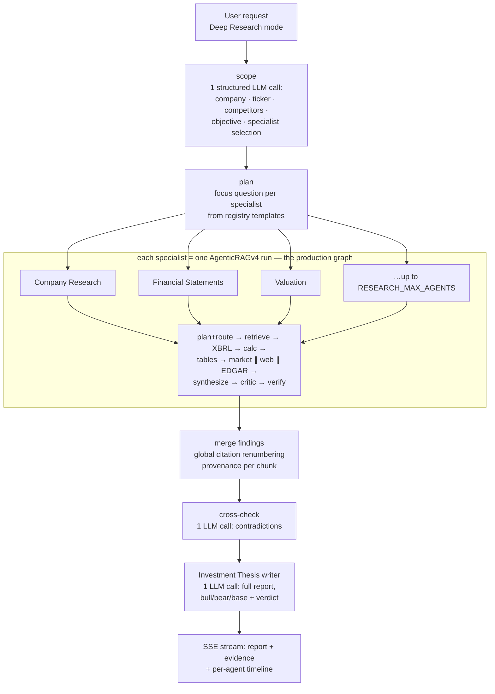

# Deep Research Mode

A second execution path next to the chat pipeline: instead of answering one
question, it produces a full, cited investment report — company overview,
financials, valuation, risks, sentiment, and a bull/bear/base investment
thesis — by running specialist research tasks through the existing production
agent and merging the findings.

The chat pipeline is untouched. Users pick the mode per message from the
input bar: **Chat** (existing) or **Deep Research** (this).

---

## Why this architecture

The repository analysis that preceded this feature (backend, agents, routing,
tools, prompts, retrieval, evaluation, frontend, API, configuration) led to
one load-bearing conclusion:

> `AgenticRAGv4` is already a complete, verified research engine *per
> question* — fused plan+route, hybrid retrieval (BM25 ∪ dense + rerank),
> grader/rewrite loop, XBRL facts, deterministic calculator, table agent,
> market data, web search, EDGAR full-text search, claim critic, deterministic
> and numeric verification.

The README also documents that a free-form conversational multi-agent layer
was previously evaluated and **rejected** (it multiplies LLM calls for no
measured quality gain). So Deep Research does not introduce a second agent
runtime. Instead:

* a **specialist is data, not code** — an id, a label, a report section, and
  a focus-question template (`finagent/research/specialists.py`);
* every specialist **executes through the unchanged production pipeline**,
  injected into the orchestrator as a runner (`rag_service.run_agentic`);
* the orchestrator adds only what a single run cannot do: scoping, task
  planning, sequencing/retry/caching, evidence merging, cross-validation,
  and thesis writing.

One execution engine, zero duplicated agent logic, and every specialist
inherits retrieval, verification and citations for free.

---

## Execution flow



Per-run LLM overhead beyond the specialist runs themselves: **3 calls**
(scope, cross-check, report). Everything else is the production agent doing
what it already does.

## Specialist registry

| id | Report section | What its focused question covers |
|---|---|---|
| `company` | Company Overview | segments, products, revenue mix, geography, moat, management |
| `sec_filings` | Recent Filings | latest 10-K/10-Q: MD&A, risk factors, legal, segment changes |
| `financials` | Financial Statement Analysis | statements + margins, FCF, liquidity, leverage, ROE/ROA — interpreted |
| `xbrl` | Key Ratios | exact filed figures + turnover/growth ratios (XBRL + calculator lanes) |
| `earnings` | Recent Quarter | latest earnings, guidance, surprises, signals |
| `forecasts` | Future Expectations | consensus estimates, price targets, catalysts |
| `insider` | Insider Activity | exec/director trades, institutional ownership, buybacks, dilution |
| `political` | Political Activity | congressional trading disclosures (with a delayed/incomplete caveat) |
| `sentiment` | Market Sentiment | news, events, analyst commentary, sector + macro backdrop |
| `competitors` | Competitor Analysis | peer comparison on growth/margins/valuation/positioning |
| `valuation` | Valuation | multiples vs history and peers, premium/discount |
| `risk` | Risks | financial/legal/regulatory/competitive/supply-chain/macro risks |
| `macro` | Industry & Macro | rates, inflation, FX, commodities, policy as they hit the company |
| `custom` | Answer to Your Question | the user's own question verbatim (runs last) |

The scoping call selects the relevant subset (capped by
`RESEARCH_MAX_AGENTS`, default 8), always anchoring on company + financials +
valuation + risk. `custom` is included only when the user asked something
specific beyond a general assessment. The final **Investment Thesis** step is
the orchestrator's own report-writer call — it sees every finding (this is
where full cross-agent context lives), the cross-check notes, and the list of
failed specialists to disclose as data gaps.

## Provenance and citations

Each specialist's answer cites `[N]` against its own evidence list. The
merger concatenates all evidence onto one global numbering, shifts each
finding's markers to match (`shift_citations`), and stamps every chunk with
the specialist that produced it. The report writer is instructed to reuse
those global numbers verbatim and never invent one — so every claim in the
final report clicks through to a source chunk in the citations panel, exactly
like chat answers.

## Failure handling, caching, performance

* **Retry + isolation** — each specialist gets one retry; a failed specialist
  is marked `failed`, disclosed in the report ("data gaps"), and the run
  continues. Only *all* specialists failing aborts. A fully exhausted key
  pool (`AllKeysExhaustedError`) aborts fast with the standard friendly
  rate-limit message.
* **Caching** — specialist findings are cached in-process for 1 h keyed by
  (specialist, question, provider, model), so re-researching the same company
  reuses runs. Below that sit the existing caches: XBRL company-facts (disk),
  market tools (TTL LRU), agent instances.
* **Report fallback** — if the thesis writer fails, the findings themselves
  are assembled into a sectioned report (deterministic, no LLM) rather than
  returning nothing.
* **Parallelism** — specialists run sequentially by default because the serve
  path pins graph runs to one worker (the vector store + reranker
  thread-safety; see `api/main.py`). `RESEARCH_PARALLEL_AGENTS=n` opts into a
  thread pool where the deployment can afford it.
* **Latency expectation** — one specialist ≈ one chat question (tens of
  seconds on the free tier), so a 6-8 agent report takes minutes. The UI sets
  that expectation with the live timeline.

## API

`POST /api/research` — SSE stream (same framing as `/api/query`).

Request (`ResearchRequest`): `question`, optional `provider_config`,
`chat_history` (so "now research it properly" resolves the company under
discussion), `max_agents` (3-14).

Events, in order:

| event | payload |
|---|---|
| `chat` | `chat_id` |
| `research_plan` | `company`, `ticker`, `objective`, `tasks: [{id, label}]` (incl. the final `thesis` task) |
| `agent_start` | `id` |
| `agent_done` | `id`, `status: done\|failed`, `detail` ("9 evidence items"), `summary` (first 400 chars) |
| `sources` | merged, globally-numbered chunks + run metadata |
| `chunk` | report text pieces (pseudo-stream) |
| `metrics` | latency, model, token totals, `agentic` = full research metadata |
| `done` | — |

Errors reuse the shared provider-error classification (`rate_limit` vs
`error`) from the chat path. Run metadata includes per-task statuses,
contradictions
flagged, token totals (specialists + report writer), and evidence counts.
Uploaded documents are not part of research runs (research covers filings +
live sources); attach files in Chat mode instead.

## Frontend flow

* **Mode toggle** (`InputBar`): Chat / Deep Research, persisted in
  `settingsStore.mode`; `useRAGQuery.ask()` picks the endpoint per message.
* **ResearchTimeline**: live agent panel while streaming — one row per
  specialist (pending ○ / running spinner / done ✓ / failed ✕ + outcome
  line, `n/total` counter). After completion it collapses to a "Research
  trail" expander where each row opens its finding summary.
* **Report**: streams into the normal markdown renderer — `##` sections,
  tables, and `[N]` citation chips wired to the citations panel all work
  unchanged because the evidence is globally renumbered server-side.
  **Export report** downloads the markdown.
* Threads persist research messages like any other (the `research` state
  rides on the message object in sessionStorage).

## Configuration

| Variable | Default | Effect |
|---|---|---|
| `RESEARCH_MAX_AGENTS` | 8 | cap on specialists per run (latency/quota bound) |
| `RESEARCH_PARALLEL_AGENTS` | 1 | specialist concurrency (leave 1 unless the deployment's graph runner is reentrant-safe) |

Provider/model/key selection reuses the per-request `provider_config`
mechanism — the model picker applies to research runs too.

## Evaluation

```bash
python -m finagent.evaluation.research_eval --sample 2          # research + baseline
python -m finagent.evaluation.research_eval --skip-baseline     # research only
```

Judge-free structural metrics per question, for the research report **and**
the single-agent baseline answering the same question: required-section
coverage (exec summary, thesis, bull/bear/base, risks), citation coverage of
substantive paragraphs, citation validity (no dangling `[N]`), source
diversity, evidence count, words, latency, tokens; research-only:
agent success rate and contradictions flagged. Resumable; writes
`results/research_eval.{json,md}` — re-run after changes and diff the `.md`
for regression testing. (Answer-level numeric correctness is already
regression-tested by the FinanceBench harness, which exercises the same
underlying agent every specialist runs through.)

## Extension guide

* **New specialist** — add one `Specialist(...)` entry in
  `specialists.py` (id, label, section, focus-question template) and mention
  it in the scoping catalog by nothing more than existing — the catalog is
  generated from the registry. No orchestrator changes.
* **New data source** — add it as a tool/lane to the production agent (the
  normal Phase pattern in `graph/nodes/`); every specialist gains it
  automatically.
* **Different report shape** — edit `REPORT_SYSTEM` in `orchestrator.py`;
  section names come from the registry.
* **Swap the runner** — anything satisfying
  `run_fn(question) -> {answer, chunks, metadata}` works (used by the tests,
  which stub it entirely).

## Testing

`tests/test_research.py` — 16 network-free tests covering registry shape,
citation renumbering, plan capping/ordering, scope fallback, evidence
merging, failure isolation, retry, the task cache, exhausted-key abort, the
deterministic report fallback, API route registration, request validation,
and the eval scorer. The pre-existing suite (`test_smoke.py`) is unchanged
and still passes — the chat pipeline is untouched.
